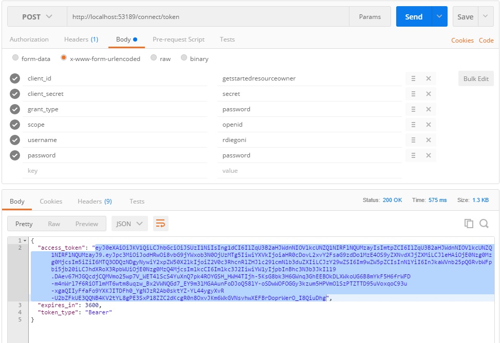
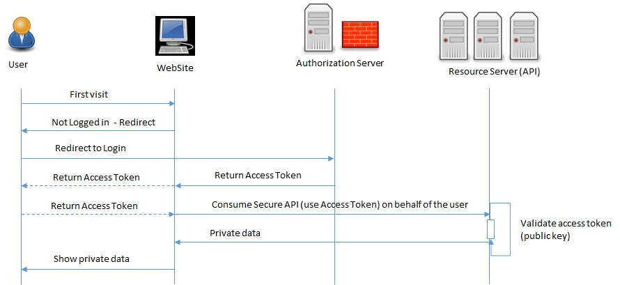
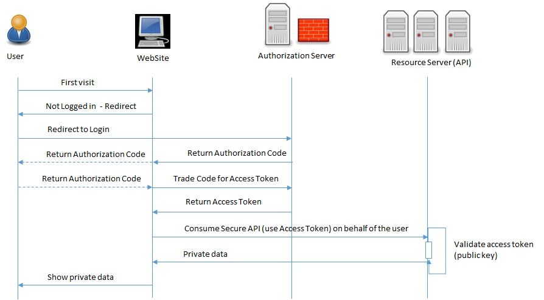

# OAuth
OAuth is an open standard for token-based Authorization (access) on the Internet.

OAuth allows an end user’s account information to be used by a third-party without exposing the user’s password. It acts as an intermediary on behalf of the end user, providing the service with an access token that authorizes specific account information to be shared. The process for obtaining the token is called a flow.

OAuth exposes several endpoints:
- **/authorize**	: give you a new token access based on an authorized performed by a client.
- **/token**		: retrieve or refresh an access token or trade Authorization code for an access token.
- **/revocation**	: revoke an access or refresh token

# OpenId Connect
OpenId Connect complements OAuth with Authentication (identity). So you can get identity information.

OpenID Connect exposes several endpoints:
- **/userInfo**				            : retrieve the user information
- **/checksession**				        : check the user session
- **/endsession**			            : end the current session
- **/.well-known/openid-configuration**	: get informations about the current configuration like the list of the endpoints and configuration
- **/.well-known/jwks**			        : list information about JWT signing keys which used for token validation.

# Token
Tokens are random strings generated by the authorization server and are issued when the client requests them.

There are 2 types of token:
- Access Token
- Refresh Token

## Access Token
An access token is sent by a client on behalf of a user to a resources server in order to use one of their resource. It is a simple JSON Web Token (JWT) which contains information about the authorized user. It is a base64 encoded information so with a base64 decoder we can have the access token information in plain text. It has a limited lifetime, which is defined by the authorization server. 

It is signed by the Authorization Server so the resource server can ensure that this access token has not been altered. The resource API should always validate the access token using a public key (this public key can be retrieved by using endpoints of OpenID Connect)

It is composed in 3 parts separated by point:
1. **Header**	        : it contains information about the encryption used so anyone that needs to verify the token know how to do that properly.
2. **Payload**	        : it contains all informations about the user, the authorization, the audience, authorization server, etc. It is a set of claims
    1. **Issuer**		: the Authorization Server that issued this token
    2. **Audience**	    : who the audience is
    3. **Expiry**		: when the token expires
    4. **Not Before**	: when we can use this token at the earliest state (e.g this token cannot be used until tomorrow)
    5. **Client Id**	: specific client that is the token for
    6. **Scopes**	    : limit access to functionality (e.g OpenId scopes are openid, profile to get the name, nickname and so on, email, address, offline_access to refresh the access token without sending the user back to the Authorization Server). You can also introduce custom scope (read to give the right to access the resource to some user, write to give the right to modify the resource to some user)
    7. **Custom data**
3. **Signature**	    : it can be used with the header to check that the payload is intact.

To decode the token, you can use the website [jwt.io](https://jwt.io/)

### Getting an Access Token
To get an access token, you need to request the Authorization Server by using its endpoint **/token** and indicating:
- **client id, client secre**	: authorization server expect information about the client that is retrieving information on behalf of a user.
- **grant type**		        : type of credential used by the client to obtain an access token (authorization code, implicit, resource owner password credentials, client credentials)

The process to get an Access Token is called a Flow. There are 4 types of Grant
- Implicit Grant
- Authorization Code Grant
- Resource Owner Password Credentials Grant
- Clients Credentials Grant

#### Implicit Grant
The implicit grant is a simplified authorization code flow optimized for clients implemented in a browser using a scripting language such as JavaScript. In the implicit flow, instead of issuing the clientan authorization code, the client is issued an access token directly. The grant type is implicit, as no intermediate credentials (such as an authorization code) are issued (and later used to obtain an access token).

When issuing an access token, the Authorization Server does not authenticate the client. In some cases, the client identity can be verified via the redirection URI used to deliver the access token to the client.

It improves the responsiveness and efficiency of some clients (such as client implemented as an in-browser application) since it reduces the number of round trips required to obtain an access token but it can be exposed to unauthorized parties (transmitted in the URI fragment each time the resources server requested). An access token must be kept confidential, and only shared among the authorization server, the resource servers the access token is valid for, and the client to whom the access token is issued. 

#### Authorization Code Grant

#### Resource Owner Password Credentials Grant

#### Clients Credentials Grant

### Validate an Access Token
Authorization Server exposes a public key which is used by the resource server and consumer to validate the access token on their end.

Most of all programming languages have library to do JWT validation but it is not possible, the OAuth extension called Token Introspection (RC 7662) which proposes an endpoint to validate the access token.

## Refresh Token
It allows to get a new access token without sending the user back to the Authorization Server. It is obtained with the first authorization by specifying the scope “offline_access”.
