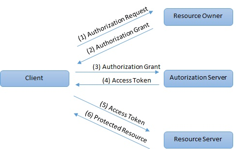
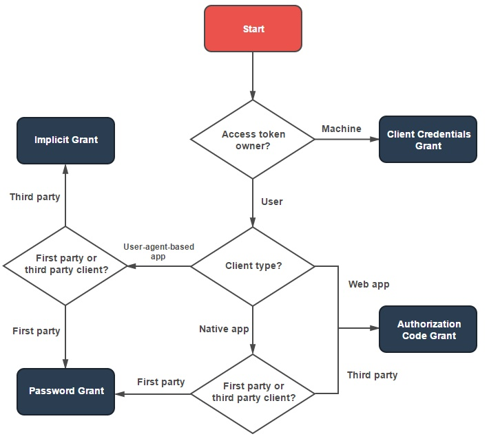
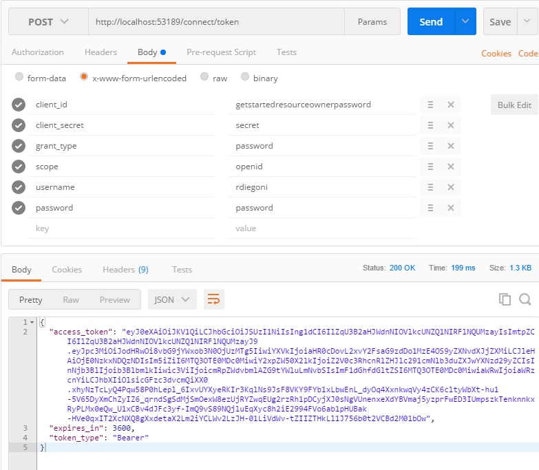

# OAuth
OAuth is an open standard for token-based Authorization (access) on the Internet.

OAuth allows an end user’s account information to be used by a third-party without exposing the user’s password. It acts as an intermediary on behalf of the end user, providing the service with an access token that authorizes specific account information to be shared. The process for obtaining the token is called a flow.

OAuth exposes several endpoints:
- **/authorize**	: give you a new token access based on an authorized performed by a client.
- **/token**		: retrieve or refresh an access token or trade Authorization code for an access token.
- **/revocation**	: revoke an access or refresh token

## Roles
OAuth defines four roles:
- **Resource owner**:  an entity capable of granting access to a protected resource. When the resource owner is a person, it is referred to as an end-user.
- **Resource server**: the server hosting the protected resources, capable of accepting and responding to protected resource requests using access tokens.
- **Client**: An application making protected resource requests on behalf of the resource owner and with its authorization.  The term "client" does not imply any particular implementation characteristics (e.g., whether the application executes on a server, a desktop, or other devices).
- **Authorization server**: the server issuing access tokens to the client after successfully authenticating the resource owner and obtaining authorization.

## Protocol flow

(1) The client requests authorization from the resource owner.  The authorization request can be made directly to the resource owner, or preferably indirectly via the authorization server as an intermediary.

(2) The client receives an authorization grant, which is a credential representing the resource owner's authorization, expressed using one of four grant types defined or using an extension grant type.

(3) The client requests an access token by authenticating with the authorization server and presenting the authorization grant.

(4) The authorization server authenticates the client and validates the authorization grant, and if valid, issues an access token.

(5) The client requests the protected resource from the resource server and authenticates by presenting the access token.

(6) The resource server validates the access token, and if valid, serves the request.

# OpenId Connect
OpenId Connect complements OAuth with Authentication (identity). So you can get identity information.

OpenID Connect exposes several endpoints:
- **/userInfo**				            : retrieve the user information
- **/checksession**				        : check the user session
- **/endsession**			            : end the current session
- **/.well-known/openid-configuration**	: get informations about the current configuration like the list of the endpoints and configuration
- **/.well-known/jwks**			        : list information about JWT signing keys which used for token validation.

# Token
Tokens are random strings generated by the authorization server and are issued when the client requests them.

There are 2 types of token:
- Access Token
- Refresh Token

## Access Token
An access token is sent by a client on behalf of a user to a resource owner in order to use one of its resource. It is a simple JSON Web Token (JWT) which contains information about the authorized user. It is a base64 encoded information so with a base64 decoder we can have the access token information in plain text. It has a limited lifetime, which is defined by the authorization server.

It is signed by the Authorization Server so the resource owner can ensure that this access token has not been altered. The resource API should always validate the access token using a public key (this public key can be retrieved by using endpoints of OpenID Connect)

It is composed in 3 parts separated by point:
1. **Header**	        : it contains information about the encryption used so anyone that needs to verify the token know how to do that properly.
2. **Payload**	        : it contains all informations about the user, the authorization, the audience, authorization server, etc. It is a set of claims
    1. **Issuer**		: the Authorization Server that issued this token
    2. **Audience**	    : who the audience is
    3. **Expiry**		: when the token expires
    4. **Not Before**	: when we can use this token at the earliest state (e.g this token cannot be used until tomorrow)
    5. **Client Id**	: specific client that is the token for
    6. **Scopes**	    : limit access to functionality (e.g OpenId scopes are openid, profile to get the name, nickname and so on, email, address, offline_access to refresh the access token without sending the user back to the Authorization Server). You can also introduce custom scope (read to give the right to access the resource to some user, write to give the right to modify the resource to some user)
    7. **Custom data**
3. **Signature**	    : it can be used with the header to check that the payload is intact.

To decode the token, you can use the website [jwt.io](https://jwt.io/)

### Getting an Access Token
A grant is a method of acquiring an access token. There are 4 types of Grant
- Implicit Grant
- Authorization Code Grant
- Resource Owner Password Credentials Grant
- Clients Credentials Grant

Deciding which grants to implement depends on the type of client the end user will be using, and the experience you want for your users.

#### Implicit Grant
The implicit grant is a simplified authorization code flow optimized for clients implemented in a browser using a scripting language such as JavaScript. In the implicit flow, instead of issuing the client an authorization code, the client is issued an access token directly. The grant type is implicit, as no intermediate credentials (such as an authorization code) are issued (and later used to obtain an access token).

When issuing an access token, the Authorization Server does not authenticate the client. In some cases, the client identity can be verified via the redirection URI used to deliver the access token to the client.

It improves the responsiveness and efficiency of some clients (such as client implemented as an in-browser application) since it reduces the number of round trips required to obtain an access token but it can be exposed to unauthorized parties (transmitted in the URI fragment each time the resources server requested). An access token must be kept confidential, and only shared among the authorization server, the resource servers the access token is valid for, and the client to whom the access token is issued.

It is typically used when the client is running in a browser using a scripting language such as Javascript. This grant type does not allow the issuance of a refresh token.

#### Authorization Code Grant
The authorization code is obtained by using an authorization server as intermediary between the client and the resource owner. Instead of requesting authorization directly from the resource owner, the client directs the resource owner to an authorization server which in turn directs the resource owner back to the client with the authorization code.

Before directing the resource owner back to the client with the authorization code, the authorization server authenticates the resource owner and obtain authorization. The resource owner's credentials are never shared with the client.

The authorization code provides a few important security benefits, such as the ability to authenticate the client, as well as the transmission of the access token directly to the client without passing it through the resource owner's user-agent and potentially exposing it to others, including the resource owner.

It should be used as soon as the client is a web server. It allows you to obtain a long-lived access token since it can be renewed with a refresh token (if the authorization server enables it).

#### Resource Owner Password Credentials Grant
The resource owner password credentials (i.e., username and password) can be used directly as an authorization grant to obtain an access token. The credentials should only be used when there is a high degree of trust between the resource owner and the client and when other authorization grant types are not available (such as an authorization code).

Even though this grant type requires direct client access to the resource owner credentials, the resource owner credentials are used for a single request and are exchanged for an access token. This grant type can eliminate the need for the client to store the resource owner credentials for future use, by exchanging the credentials with a long-lived access token or refresh token.

It is mainly used when the client has been developed by the same authority as the authorization server. For example, we could imagine a website named example.com seeking access to protected resources of its own subdomain api.example.com. The user would not be surprised to type his login/password on the site example.com since his account was created on it.

#### Clients Credentials Grant
This type of authorization is used when the client is himself the resource owner. The end-user does not have to give its authorization for accessing the resource server.

This grant is suitable for machine-to-machine authentication.

### Validate an Access Token
Authorization Server exposes a public key which is used by the resource server and consumer to validate the access token on their end.

Most of all programming languages have library to do JWT validation but it is not possible, the OAuth extension called Token Introspection (RC 7662) which proposes an endpoint to validate the access token.

## Refresh Token
It allows to get a new access token without sending the user back to the Authorization Server. It is obtained with the first authorization by specifying the scope “offline_access”.
